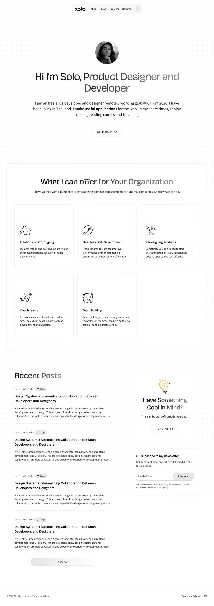

# 🚀 Solo Portfolio Website

A modern, responsive portfolio website built using **React.js** and **Tailwind CSS**, inspired by clean product design and smooth developer workflows.

## 📸 Preview



## 🛠️ Tech Stack

- **React.js** – Frontend framework
- **Tailwind CSS** – Utility-first styling
- **Vite** – Fast bundling and dev server
- **Dark Mode** – Fully themeable UI
- **Responsive Design** – Works across all screen sizes

## ✨ Features

- Personal intro section with headline
- Services / "What I offer" section
- Recent blog posts
- Dark mode toggle
- Clean grid layout using Tailwind
- Fully responsive and accessible

## 📂 Project Structure

```bash
src/
├── assets/          # Images & icons
├── components/      # Reusable UI components
├── pages/           # Main sections like Home, About
├── App.jsx          # Main entry component
├── main.jsx         # App bootstrap
└── index.css        # Tailwind base and custom styles
```

This Is The Actual Link Of The Live Working Site --- https://loopportforlio.netlify.app/
